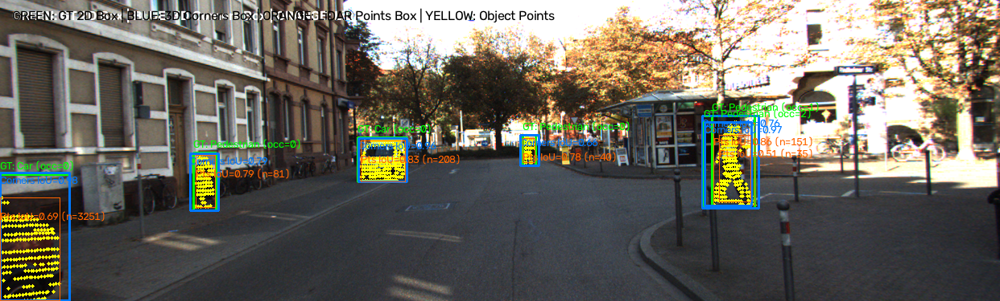
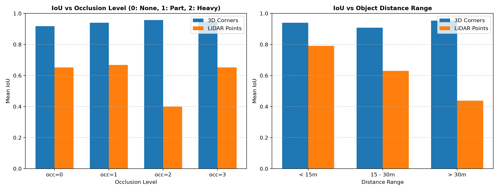
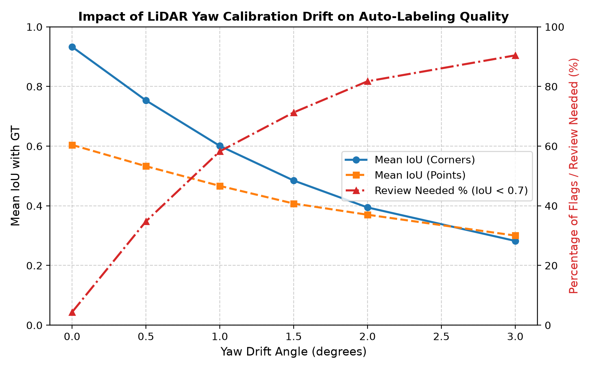
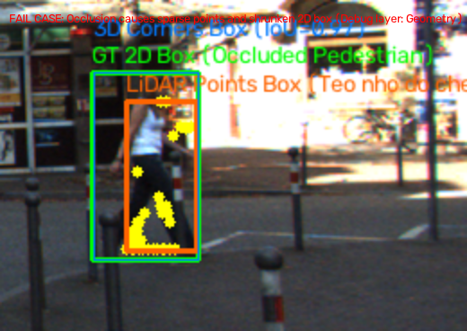
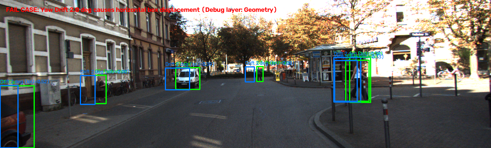

# Báo cáo Day 6: Hỗ trợ gán nhãn 2D và kiểm định chất lượng (QA) từ LiDAR 3D

- **Họ tên:** Nguyễn Minh Quyền
- **MSSV:** 2A202602438
- **Lớp:** AI20K Track 4
- **Link repo:** https://github.com/ngminhquyen2710-sketch/NguyenMinhQuyen-2A202602438-Track4-Day21
- **Topic:** F — Hỗ trợ gán nhãn bằng LiDAR (Auto-label support)
- **Dataset:** data/kitti_mini
- **Các frame đã dùng:** 000001, 000004, 000007, 000008, 000009, 000010, 000011, 000012, 000015, 000016, 000019, 000021, 000023, 000025, 000031, 000032, 000043, 000048, 000049, 000061

## 1. Claim

Chiếu 8 đỉnh 3D box lên ảnh camera (Corners method) đạt IoU trung bình 0.933 với ground truth 2D, nhưng độ lệch calibration yaw chỉ 1.0° khiến IoU giảm mạnh xuống 0.601 và làm hơn 58% nhãn bị gắn cờ cần review (ngưỡng IoU < 0.70); trong khi phương pháp dùng điểm LiDAR (Points method) bị suy giảm nghiêm trọng khi khoảng cách > 30 m (IoU giảm còn 0.438) hoặc khi vật thể bị che khuất nặng (IoU giảm còn 0.400).

## 2. Evidence

Thí nghiệm được thực hiện trên toàn bộ 20 frames (115 vật thể hợp lệ) của `data/kitti_mini`. Dữ liệu chi tiết nằm tại `results/autolabel_benchmark.csv` và `results/calibration_drift_sweep.csv`.

### Bảng 1: Ảnh hưởng của góc lệch Calibration Yaw Drift (Benchmark 115 objects)
| Góc lệch Yaw (deg) | IoU Corners (Mean) | IoU Points (Mean) | Tỉ lệ cần Review Corners (IoU < 0.7) | Tỉ lệ cần Review Points (IoU < 0.7) |
|---|---|---|---|---|
| 0.0° (Gốc) | 0.9330 | 0.6042 | 4.35% | 53.91% |
| 0.5° | 0.7533 | 0.5328 | 34.78% | 66.96% |
| 1.0° | 0.6008 | 0.4667 | 58.26% | 73.91% |
| 1.5° | 0.4847 | 0.4076 | 71.30% | 79.13% |
| 2.0° | 0.3945 | 0.3701 | 81.74% | 80.00% |
| 3.0° | 0.2823 | 0.3002 | 90.43% | 83.48% |

### Bảng 2: So sánh theo khoảng cách và độ che khuất (Occlusion)
| Phân loại | Số mẫu | IoU Corners | IoU Points | Điểm LiDAR TB |
|---|---|---|---|---|
| Gần (< 15 m) | 32 | 0.9398 | 0.7903 | 1501 |
| Trung bình (15 – 30 m) | 41 | 0.9071 | 0.6294 | 242 |
| Xa (> 30 m) | 42 | 0.9532 | 0.4377 | 43 |
| Occlusion 0 (Rõ) | 59 | 0.9177 | 0.6522 | 484 |
| Occlusion 2 (Che nặng) | 23 | 0.9566 | 0.3995 | 173 |

Đo thời gian chạy (latency trên 6 objects, CPU Intel Core):
- Corners method: p50 = 0.325 ms, p95 = 0.417 ms.
- Points method: p50 = 17.958 ms, p95 = 21.991 ms.





## 3. Failure case

Hai failure cases đặc trưng được tìm thấy trong quá trình thực nghiệm:

1. **Occlusion (Pedestrian tại frame 000011, occluded=2):**
   - **Hiện tượng:** Điểm LiDAR chỉ phản xạ từ phần cơ thể không bị che khuất (nửa trên), dẫn đến 2D box tạo từ LiDAR points bị teo nhỏ và có IoU chỉ đạt 0.510 so với Ground Truth 2D (nhãn người vẽ cho toàn bộ cơ thể ước tính).
   - **Lớp debug:** **Geometry** & **Preprocess** (Quy ước gán nhãn: nhãn 2D con người ước lượng toàn bộ vật thể, trong khi LiDAR chỉ thu nhận bề mặt nhìn thấy trực tiếp).
2. **LiDAR Sparsity ở khoảng cách xa (> 30 m):**
   - **Hiện tượng:** Mật độ chùm tia quét bị thưa theo quy luật hình nón, các xe ở khoảng cách 35–45 m chỉ có dưới 20 điểm LiDAR, khiến 2D box từ điểm bị hụt biên (IoU chỉ 0.438).
   - **Lớp debug:** **Preprocess** & **Metric** (Độ phân giải góc của cảm biến LiDAR).




## 4. Khuyến nghị nếu triển khai thật

- **Use-case:** Áp dụng cho Auto-labeling và QA Tool trong pipeline huấn luyện mô hình nhận diện vật thể cho xe tự hành (ADAS/AV).
- **Thiết kế hybrid tối ưu:** Dùng Corners Method làm baseline dự đoán khung tổng thể (tốc độ cực nhanh ~0.3 ms/frame), kết hợp kiểm tra mật độ điểm LiDAR bên trong hộp để lọc các vật thể ở xa hoặc bị che khuất.
- **Đánh đổi (Trade-off):** Corners Method không phụ thuộc mật độ tia nhưng nhạy cảm với calibration drift; Points Method độc lập với kích thước hộp nhưng phụ thuộc mật độ tia và rất chậm khi xử lý point cloud lớn (~18 ms).
- **Chỉ số cần giám sát khi chạy thật:** Giám sát liên tục chỉ số IoU phân vị 10 (10th-percentile IoU) giữa box chiếu và box detector; nếu IoU trung bình giảm xuống dưới 0.70 thì kích hoạt cảnh báo LiDAR-Camera Bracket Drift để cân chỉnh lại cảm biến.

## 5. Cách chạy lại

```bash
# 1. Chiếu điểm LiDAR lên ảnh camera cơ bản (CP2)
python -m starter.projection --data-root data/kitti_mini --frame 000011

# 2. Chạy toàn bộ pipeline Topic F (Auto-label QA, Benchmark 20 frames, Drift sweep, Latency, Failure cases)
python -m src.autolabel_qa --data-root data/kitti_mini --mode all

# 3. Kiểm tra tính hợp lệ của bài nộp
python tools/check_submission.py
```

## 6. Khai báo sử dụng AI

| Công cụ | Dùng cho việc gì | Bạn đã kiểm chứng thế nào |
|---|---|---|
| Gemini 3.8 Flash | Hỗ trợ cấu trúc script `src/autolabel_qa.py`, vẽ biểu đồ matplotlib và định dạng báo cáo | Tự chạy kiểm thử toán học trên toạ độ synthetic và KITTI, kiểm tra code với lệnh `python tools/check_submission.py`  |
